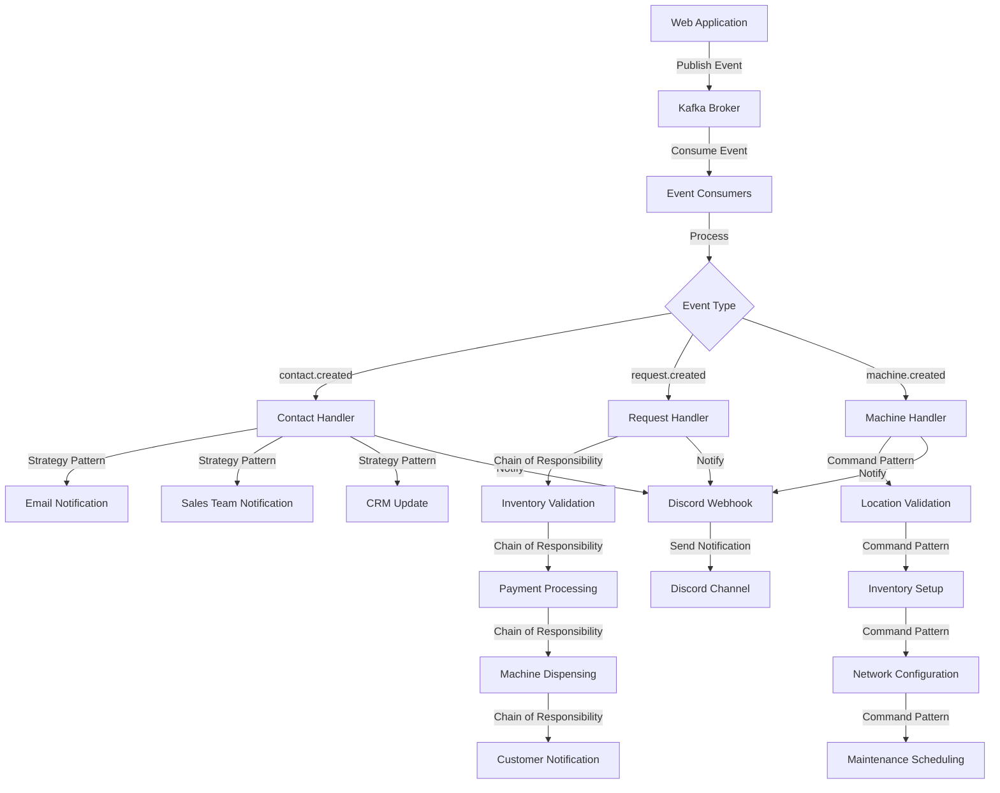

# Kafka Flow and Discord Integration

This document provides an overview of the Kafka event flow in the SipEat application and how Discord notifications are integrated with it.

## Architecture Overview

The SipEat application uses an event-driven architecture with Apache Kafka as the event streaming platform. The system consists of three main components:

1. **Event Publishers**: Components that publish events to Kafka topics
2. **Kafka Broker**: The central event streaming platform
3. **Event Consumers**: Components that consume events from Kafka topics and process them

Each event in the system is also sent as a notification to Discord using webhooks, providing real-time visibility into the system's operation.

## Event Flow Diagram



## Event Types and Topics

SipEat uses three main Kafka topics:

1. **sipeat.contact.events**: Events related to contact form submissions
2. **sipeat.request.events**: Events related to drink requests
3. **sipeat.machine.events**: Events related to machine management

Each topic handles a specific event type:

| Topic | Event Type | Description |
|-------|------------|-------------|
| sipeat.contact.events | contact.created | Triggered when a customer submits a contact form |
| sipeat.request.events | request.created | Triggered when a customer requests a drink |
| sipeat.machine.events | machine.created | Triggered when a new machine is added |

## Discord Integration

Every Kafka event processed by the system is sent as a notification to Discord. This provides:

1. **Real-time visibility** into system operations
2. **Error alerts** when event processing fails
3. **Audit trail** of all system events

### Discord Notification Format

Discord notifications are sent as rich embeds with the following information:

- **Title**: Event type with appropriate icon
- **Color**: Green for successful processing, red for failures
- **Fields**: All relevant event data
- **Footer**: Processing status
- **Timestamp**: When the event was processed

### Sample Discord Notifications

#### Successful Contact Event

```
📝 contact.created event processed
---
📝 New Contact Form Submission
---
Name: John Doe
Email: john@example.com
Phone: +1234567890
Company Name: Acme Inc
Message: I'd like to inquire about your services
---
✅ Successfully processed | 2023-07-15T14:30:45Z
```

#### Failed Request Event

```
🥤 request.created event failed
---
🥤 New Drink Request
---
Customer Name: Jane Smith
Drink Name: Coca-Cola
Machine ID: M12345
Machine Name: Office Lobby
Error: Payment processing failed
---
❌ Processing failed | 2023-07-15T15:22:10Z
```

## Implementation Details

The Discord integration is implemented using webhook technology. The system:

1. Processes each Kafka event normally
2. At the end of processing (success or failure), sends a notification to Discord
3. Includes all relevant event data and status information

The integration uses the `sendKafkaEventNotification` function in `src/lib/discord.ts`, which is called by each event handler after processing an event.

### Implementation Features

- **Rate limiting handling**: Automatically retries when Discord rate limits are hit
- **Error handling**: Gracefully handles Discord API errors without affecting Kafka processing
- **Field validation**: Ensures fields don't exceed Discord's limits (1024 chars per field value)
- **Embed limits**: Respects Discord's limits on embeds (10) and fields (25)
- **Fallback mechanism**: Uses a default webhook URL if environment variable is not set
- **Robust error handling**: Catches and logs errors without disrupting the main application flow

## Configuration

To enable Discord notifications, set the `DISCORD_WEBHOOK` environment variable in your `.env.local` file:

```
DISCORD_WEBHOOK=your-discord-webhook-url
```

If you don't set this environment variable, the system will use a default webhook URL that's hardcoded in the application.

## Testing the Discord Integration

We've included a dedicated test script to verify that your Discord webhook integration is working correctly:

```bash
# Run the Discord webhook test script
npm run test:discord
```

This script will:

1. Send a simple text message to your Discord channel
2. Send a message with rich embeds
3. Simulate a successful contact.created event
4. Simulate a failed request.created event with error information
5. Simulate a successful machine.created event

After running the script, check your Discord channel to verify that all test messages were received correctly.

## Troubleshooting Discord Integration

If you're experiencing issues with Discord notifications:

1. **Check your webhook URL**: Ensure it's correctly formatted and valid
2. **Check rate limits**: Discord has rate limits that may affect high-volume notifications
3. **Verify webhook permissions**: Make sure the webhook has permission to post in the channel
4. **Check error logs**: Look for Discord-related errors in your application logs
5. **Run the test script**: Use `npm run test:discord` to verify basic functionality

## Testing

To test the full Kafka-Discord integration:

1. Start the Kafka infrastructure with `npm run kafka:start`
2. Start the event consumers with `npm run consumers`
3. Trigger events by:
   - Submitting a contact form
   - Creating a drink request
   - Adding a new machine
4. Check your Discord channel for notifications 